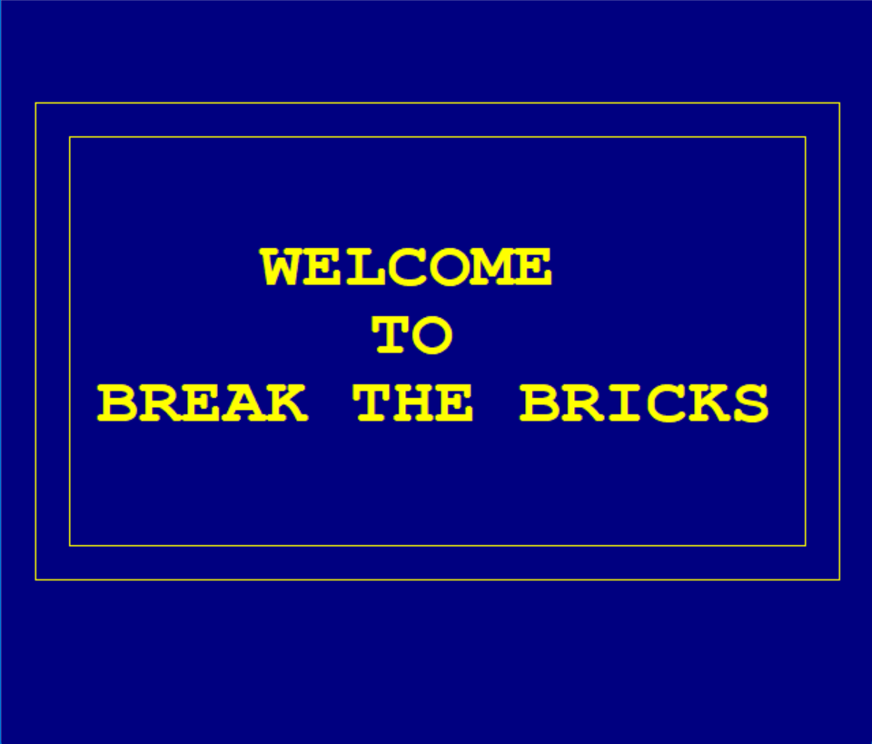
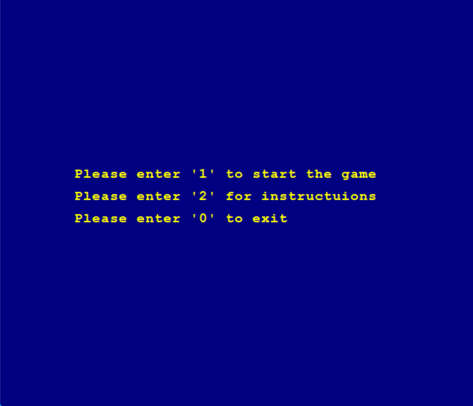
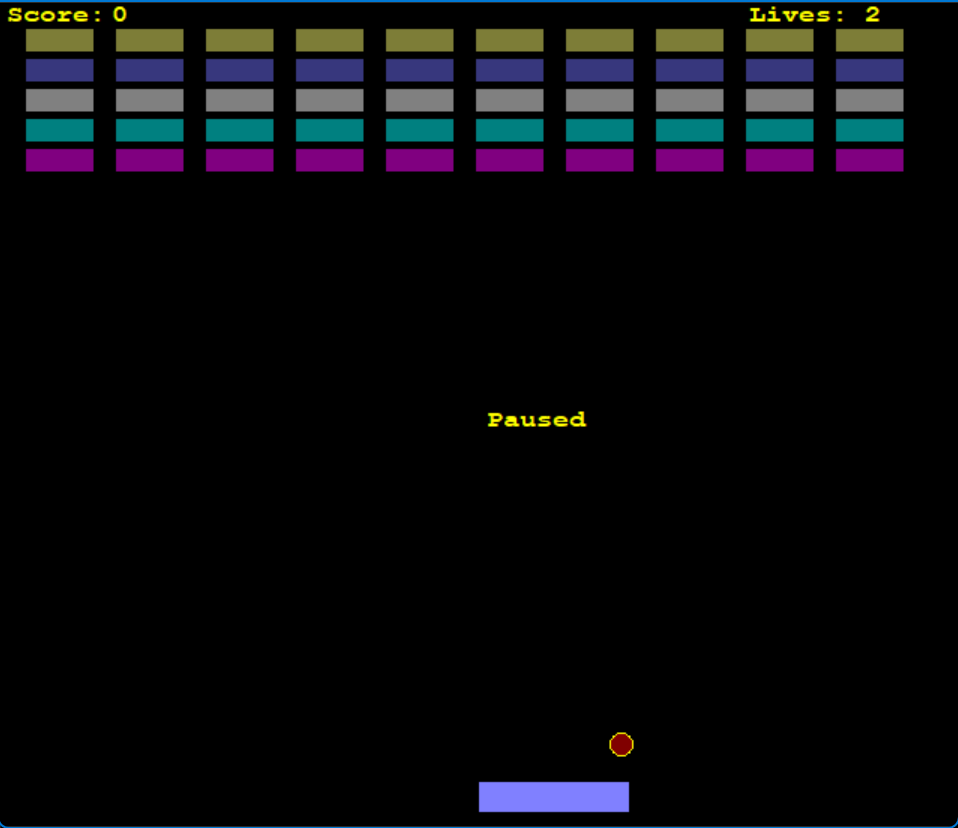
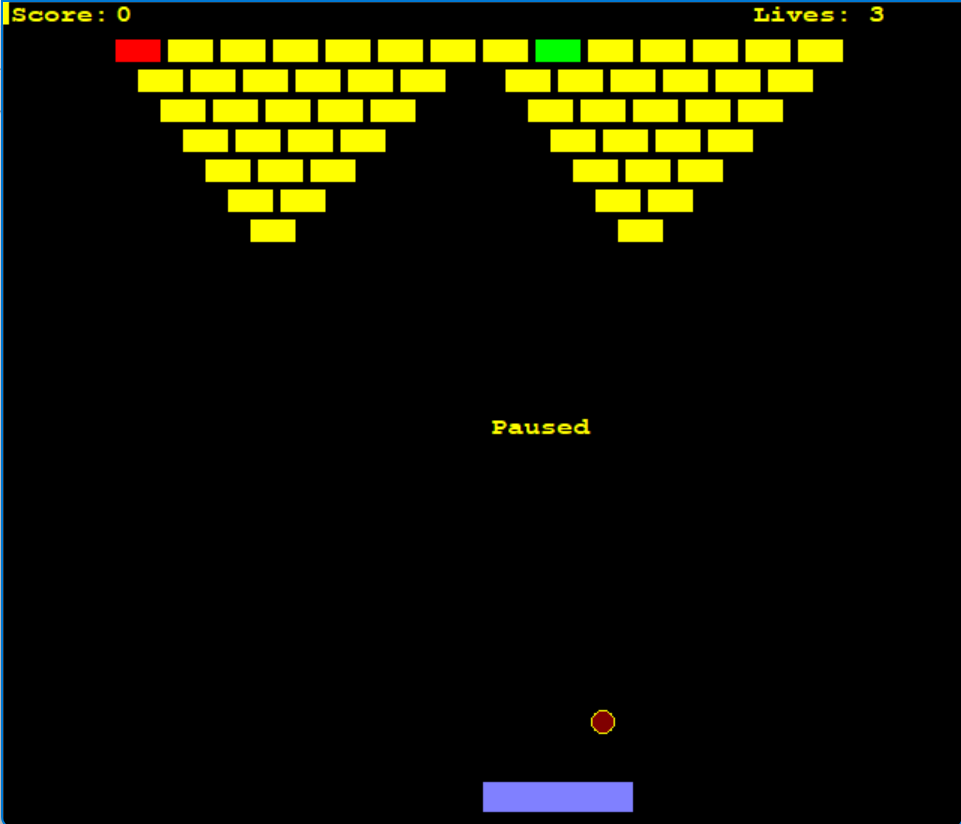
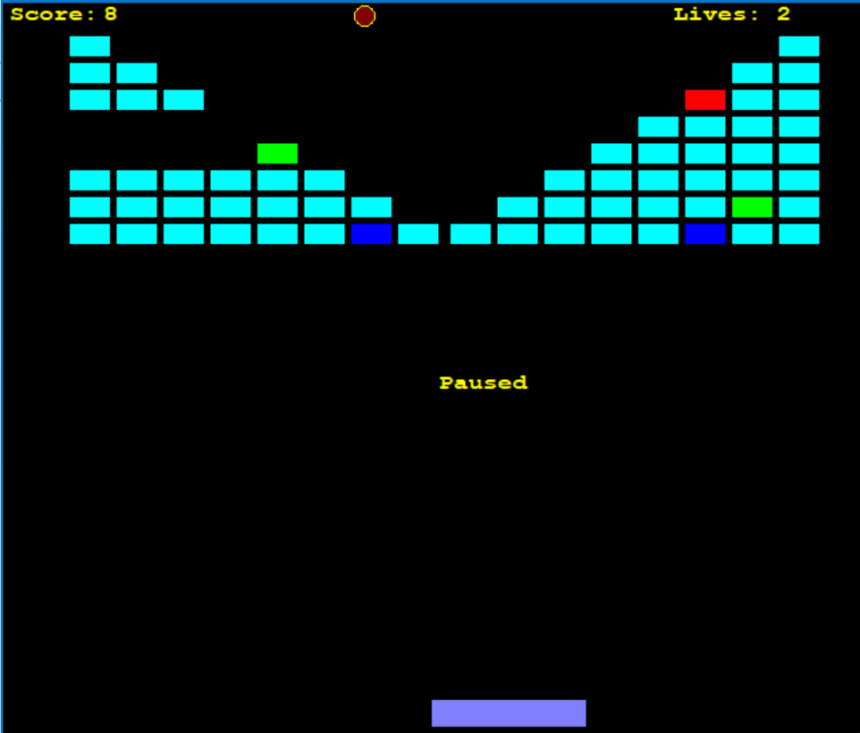

# 🧱 Break The Bricks (C++ Game)

A classic **Brick Breaker** game built in C++ using `graphics.h`.  
Includes **Easy, Medium, and Hard** levels with special bricks for power-ups.  

---

## 🎮 Controls
- **← / →** : Move paddle  
- **SPACE** : Pause/Resume  
- **0** : Exit  

---

## ⚙️ Features
- Multiple levels: Easy, Medium, Hard  
- Power-up bricks:
  - 🔴 Red → Increases paddle size  
  - 🟢 Green → Extra life  
  - 🔵 Blue → Speeds up ball  
- Score and lives system  
- Game Over & Winning screen  

---

## 🚀 How to Run
Compile with WinBGI (`graphics.h`) and required libraries.

---

## 📷 Screenshots

### Home Screen

### Menu

### Easy Level

### Medium Level

### Hard Level

